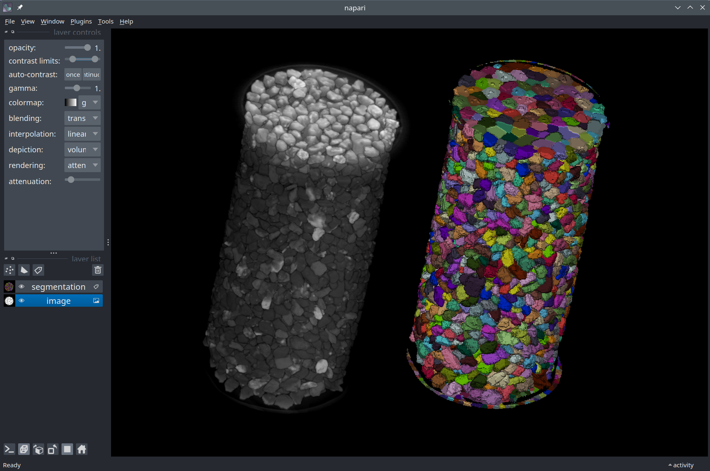

# Image data visualization with Python and Napari



[Napari](https://www.napari.org/) is a multi-dimensional image viewer for Python. It is used to visualize scientific images and the data associated with them, such as segmentation masks, bounding boxes, and keypoints, for example. With Napari, you can

- visualize timeseries, 2D, 3D, and multi-channel images.
- create interactive visualizations tailored to your needs.
- set up visualizations in a Python script or a [Jupyter notebook](https://jupyter.org/).
- annotate data (draw segmentation masks, polygons, etc.).
- use [plugins from the community](https://www.napari-hub.org/) or develop and share your own plugin.
  
Click on the links below to learn more about Napari.

````{grid} 1 1 2 4
```{grid-item-card}
:link: https://napari.org/
:img-top: ./images/napari-logo.png
:text-align: center
napari.org
```
```{grid-item-card}
:img-top: ./images/napari-hub.png
:link: https://www.napari-hub.org/
:text-align: center
napari-hub.org
```
```{grid-item-card}
:link: https://forum.image.sc/tag/napari
:img-top: ./images/imagesc.png
:text-align: center
Image.sc
```
```{grid-item-card}
:link: https://github.com/napari/napari
:img-top: ./images/github-fig.png
:text-align: center
github.com/napari
```
````

## Next steps

- Have a look at our [Napari Q&A](./questions.md) page which will answer some questions you may have about Napari.
- [Start](./getting_started.md) using Napari by installing it and downloading this workshop material.
- Have a look at our [notebook case studies](./notebooks/README.md) to understand what is possible to do with Napari.
  
🎉 Happy visualization!