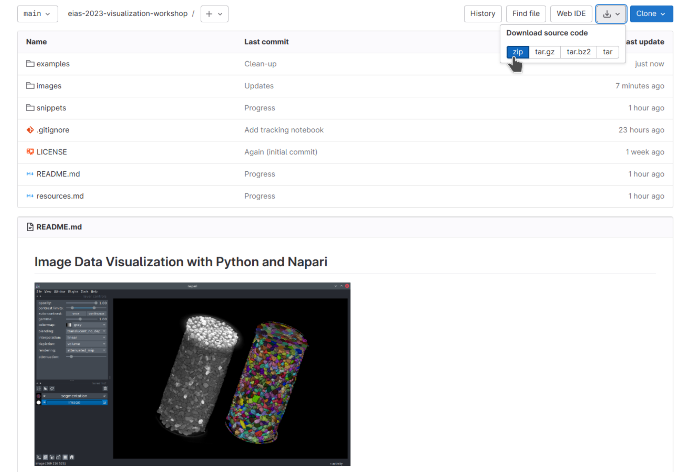
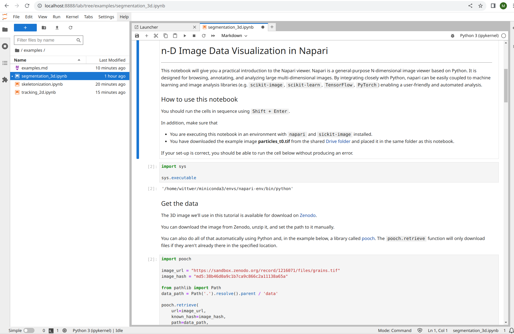

# Downloading and launching this workshop's Jupyter notebooks

In the following chapter ([Image data visualization case studies](./notebooks/README.md)) you'll discover a selection of Jupyter notebook examples that showcase the usage of Python and Napari for scientific image analysis. If you want to actually run these Jupyter notebook examples, you'll have to download them from the source repository of this website on GitHub and run them in Jupyter lab.

Find the repository at this link: [napari-imaging-epfl-2023](https://github.com/MalloryWittwer/napari-imaging-epfl-2023).

Download and unzip the repository on your machine (or use `git` if you prefer).



Then, open your terminal and follow the steps below.

1. From the command-line, navigate to the repository folder you just downloaded using `cd`. For example:
```
cd ~/Desktop/napari-imaging-epfl-2023/
```
1. Activate your `Python environment`.
```
conda activate napari-env
```
1. There are some extra Python packages listed in this repository's `requirements.txt` file. Install them using:

```bash
pip install -r requirements.txt
```
4. Start the `Jupyter Lab` application.
```
jupyter lab
```

Jupyter Lab will open in a web browser window.



Navigate to the folder `learning-material/notebooks/`. From there, you should be able to open, run, and edit the example notebooks as you like.

````{dropdown} What if I'm only interested in a single notebook?
Instead of downloading the whole repository, you can also choose to download a single notebook file:
```{image} images/download_notebook.png
:align: center
```
````