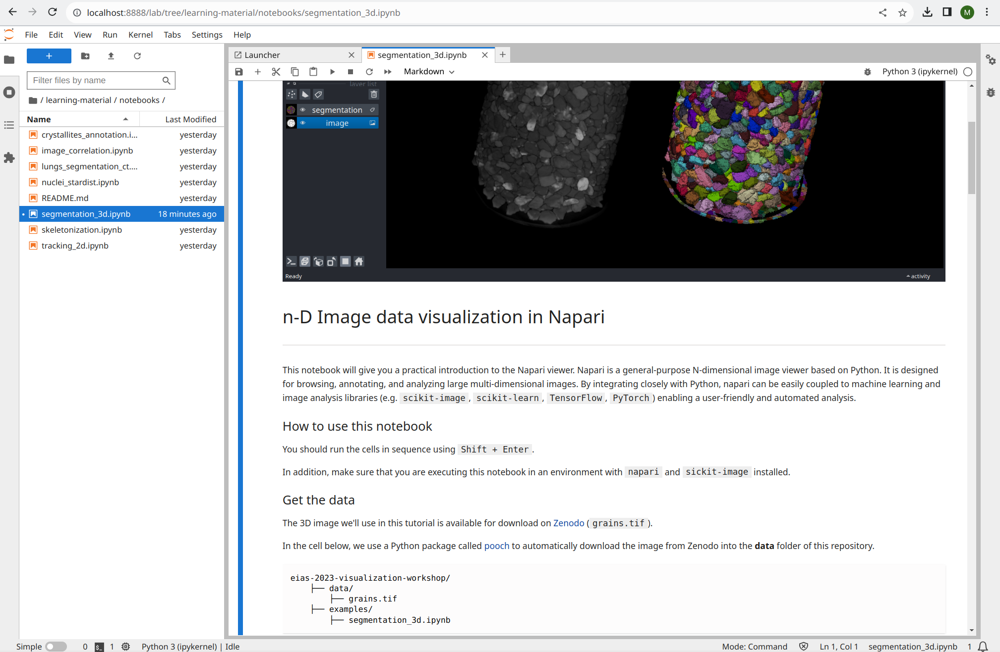

# Downloading and launching this workshop's Jupyter notebooks

If you'd like to run the Jupyter notebook examples from this repository on your machine ([Image data visualization case studies](./learning-material/notebooks/README.md)), you'll have to download the repository materials and start a `jupyter lab` session. Follow the steps below in order to do that.

First, download and unzip this repository on your machine (or use `git` if you prefer).


Open your terminal and follow the steps below.

1. From the command-line, navigate to the repository folder you just downloaded using `cd`. For example:
```
cd ~/Desktop/eias-2023-visualization-workshop/
```
1. Activate your `Python environment`.
```
conda activate napari-env
```
There are some extra Python packages listed in this repository's `requirements.txt` file. Install them using:

```bash
pip install -r requirements.txt
```
1. Start the `Jupyter Lab` application.
```
jupyter lab
```

Jupyter Lab will open in a web browser window.



Then, navigate to the folder `learning-material/notebooks/`. From there, you should be able to open, execute, and edit the example notebooks as you like.