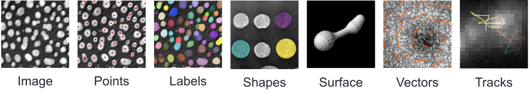

# Napari Q&A

Below are short answers to some questions you may have about Napari.

```{dropdown} 1. What is Napari and what is it used for?
[Napari](https://www.napari.org/) is a multi-dimensional image viewer for Python. It is used to visualize scientific images and the data associated with them, such as segmentation masks, bounding boxes, and keypoints, for example.

With Napari, you can

- visualize timeseries, 2D, 3D, and multi-channel images.
- create interactive visualizations tailored to your needs.
- set up visualizations in a Python script or a [Jupyter notebook](https://jupyter.org/).
- annotate data (draw masks, polygons, etc.).
- use [plugins from the community](https://www.napari-hub.org/) or develop and share your own plugin.
```

```{dropdown} 2. Where can I learn more about Napari?
Here are a few places where to learn more about Napari.
- [Napari.org](https://napari.org/)
- [Usage (Napari.org)](https://napari.org/usage.html)
- [API reference (Napari.org)](https://napari.org/api/index.html)
- [Workshops (Napari.org)](https://napari.org/stable/further-resources/napari-workshops.html)
Moreover, you can stay tuned with the community by following [@napari_imaging](https://twitter.com/napari_imaging) on X (Twitter) and keeping an eye on the [Image.sc](https://forum.image.sc/tag/napari) forum.
```

```{dropdown} 3. How is Napari related to Python?
Napari is a [Python package](https://pypi.org/project/napari/). Its source code can be found in a [GitHub repository](https://github.com/napari/napari).

Therefore, Napari integrates seamlessly into the scientific Python ecosystem. It can be easily coupled to machine learning and image analysis projects that use Python libraries, such as [Scikit-image](https://scikit-image.org/), [OpenCV](https://opencv.org/), or [PyTorch](https://pytorch.org/).
```

```{dropdown} 4. How to install Napari?
Napari should be installed as a **Python package** using `pip` or `conda`. For more details, have a look at the official [installation page](https://napari.org/stable/tutorials/fundamentals/installation.html#installation) as well as this repository's [installation and setup instructions](./installation.md).
```

````{dropdown} 5. Can Napari be started from the terminal?
Yes! In your terminal, with your Python environment activated and Napari installed in it, type
```{code} bash
napari
```
The Napari viewer should open in a separate window.
```{image} images/napari_terminal.gif
:align: center
```
````

````{dropdown} 6. How can I open an image in Napari?
There are several ways to open images in Napari. The easiest is probably to **Drag and drop** the image file directly into the viewer window. You can also use `File` > `Open File(s)` from the menu.

```{image} images/draganddrop.gif
:align: center
```
<br>
Lastly, you can open images programmatically from a Python script or a Jupyter notebook.

```{code} python
import napari

# Create a new viewer with the image opened in it
viewer = napari.view_image(image)
```

````

````{dropdown} 7. What controls do I have in the Napari viewer?
The **layer controls** interface lets you change the *contrast*, *opacity*, *colormap*, and *blending* settings of individual layers, among other things, as well as the *rendering* mode in 3D view.

```{image} images/layer_controls.png
:height: 250px
:align: center
```
<br>
You can toggle between **2D and 3D views**, and between **grid and overlay modes**, and change the **orientation** of the image by clicking on the corresponding icons at the bottom-left corner of the viewer.

```{image} images/viewer_icons.png
:height: 35px
:align: center
```
````

```{dropdown} 8. Where does the name Napari come from?
Napari is a settlement located at the north end of Tabuaeran atoll, Kiribati 🏝. You can learn more about it on [Wikipedia](https://en.wikipedia.org/wiki/Napari).
```

````{dropdown} 9. Can I use Napari for annotating data?
Absolutely, Napari can be used as an annotation tool. You can manually annotate **keypoints**, **polygons** (e.g. bounding boxes) and **draw segmentation masks**.
```{image} images/annotate.gif
:align: center
```
To learn more about this topic, check out the [Annotation](https://napari.org/stable/tutorials/annotation/index.html) page from the docs.
````

````{dropdown} 10. What kinds of images can be viewed in Napari?
With Napari, you can view images with an arbitrary number of dimensions (which is why it's called an n-D image viewer). You can open **2D images** in both grayscale and **RGB** (color) mode, **3D images**, **timeseries** (2D+t, 3D+t), and **multichannel** images.
```{image} images/mitosis.gif
:align: center
```

Napari's built-in image reader can open a number of common image file formats (TIF, PNG, JPEG...). In addition, many reader plugins (e.g. [napari-aicsimageio](https://github.com/AllenCellModeling/napari-aicsimageio), [napari-medical-image-formats](https://github.com/MBPhys/napari-medical-image-formats)) can be installed to open specific file formats.
````

```{dropdown} 11. Besides images, what other kinds of data can be visualized in Napari?
You can add multiple layers of different types into the viewer and adjust their properties. Napari supports seven different layer types: **Image**, **Labels**, **Points**, **Vectors**, **Shapes**, **Surface** and **Tracks**. Each layer corresponds to a different data type and has its own set of visualizations and interactive controls.



To learn more about this topic, check out [Using layers (Napari.org)](https://napari.org/stable/howtos/layers/index.html).
```

`````{dropdown} 12. How is Napari related to Numpy?
[Numpy](https://numpy.org/) is a fundamental package for scientific computing and image analysis in Python. 

The images and the other types of image data that can be loaded into Napari (points, vectors, etc.) are all represented as `Numpy arrays`. Similarly, the data passed in argument to `viewer.add_image()`, `viewer.add_points()`, etc. should be Numpy arrays.

````{note}
You can access the Numpy arrays loaded into Napari through the `data` attribute of the layer. For example
```{code} python
# Access the data loaded in the first layer in the viewer
print(viewer.layers[0].data)
```
````
`````

```{dropdown} 13. How is Napari related to Jupyter notebooks?
You can launch Napari from a Jupyter notebook, in which case you'll be able to interactively load and save data from the viewer and control all of its features programmatically. You can take advantage of notebook functionalities, such as annotating your code using `Markdown` and running cells one by one to perform your analysis.

There are several examples of [Image data visualization case studies](./notebooks/README.md) in this repository that you can check out. These case studies take the form of Jupyter notebooks and give you examples of what you can do with Napari in different contexts.
```

```{dropdown} 14. What are Napari plugins? Where can I find them?
[Plugins](https://napari.org/stable/plugins/index.html) are a way of extending the viewer's functionality by providing custom user interfaces and commands for realizing specific tasks. The [Napari Hub](https://www.napari-hub.org/) offers a listing of over 300 plugins developed by the community.

You can install Napari plugins as Python packages using `pip` (e.g. `pip install stardist-napari`) or through the viewer's menu: `Plugins` > `Install/Uninstall Plugins...`.
```

```{dropdown} 15. Can I develop my own Napari plugin?
Once you have developed a working image analysis functionality, you can [turn it into a plugin](https://napari.org/stable/plugins/first_plugin.html). If you think your plugin could be useful to others, you can publish it as a Python package and share it on the [Napari Hub](https://www.napari-hub.org/).

To develop your own Napari plugin, you will likely have to learn how to use the [`magicgui`](https://napari.org/stable/guides/magicgui.html) library as well as the basics of [Qt for Python](https://doc.qt.io/qtforpython-6/), which are the tools behind user interface creation in Napari.
```

```{dropdown} 16. Where can I find examples of Napari visualizations?
Check out the [Napari Examples Gallery](https://napari.org/stable/gallery.html). You can also find several [Image data visualization case studies](./notebooks/README.md) in this repository.
```

```{dropdown} 17. What is the Napari bundled app?
In principle, Napari can be installed as a [bundled app](https://napari.org/stable/tutorials/fundamentals/installation.html#install-as-a-bundled-app). However, the bundled app is still in active development, may not be very stable, and you cannot install plugins in it. Therefore, it is strongly recommended to install Napari as a Python package instead.
```

```{dropdown} 18. Where can I find help in image analysis in EPFL?
The Center for Imaging's [Image Analysis Hub](https://imaging.epfl.ch/image-analysis/#hub) provides EPFL-wide support in image analysis. Don't hesitate to contact us by sending an email at `imaging@epfl.ch` to schedule a discussion about your specific challenges. We're always happy to help!
```