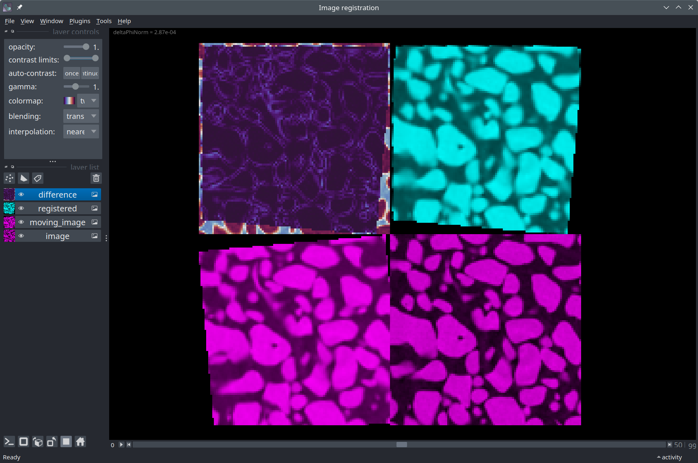

# Image data visualization case studies

A collection of examples involving scientific image processing and analysis in Python and visualization in Napari.

<table>
  <tr>
    <td style="vertical-align: center;">
      <a href="segmentation_3d.ipynb">n-D Image data visualization in Napari</a>
      
Introduction to the Napari viewer and segmentation of a 3D CT scan of a granular material sample using the watershed transform.

    </td>
    <td>
      
    </td>
  </tr>
  <tr>
    <td style="vertical-align: center;">
      <a href="tracking_2d.ipynb">Cell detection and tracking</a>
      
Detection, tracking, and visualization of dividing cell nuclei in a timeseries.

    </td>
    <td>
      
    </td>
  </tr>
  <tr>
    <td style="vertical-align: center;">
      <a href="skeletonization.ipynb">Skeleton analysis of a drosophila trachea</a>
      
Analysis of the elongated branching structure of a drosophila trachea in a 3D confocal image using the <a href="https://skeleton-analysis.org/stable/index.html">Skan</a> package.

    </td>
    <td>
      
    </td>
  </tr>
  <tr>
    <td style="vertical-align: center;">
      <a href="lungs_segmentation_ct.ipynb">Lungs convex hull detection</a>
      
Segmentation of the convex hull of the lungs of a mouse in a CT scan (3D).

    </td>
    <td>
      
    </td>
  </tr>
  <tr>
    <td style="vertical-align: center;">
      <a href="crystallites_annotation.ipynb">Annotating triangular crystallites</a>
      
Interactive annotation of triangular crystallites and visualization of their orientation distribution.

    </td>
    <td>
      
    </td>
  </tr>
  <tr>
    <td style="vertical-align: center;">
      <a href="image_correlation.ipynb">Digital image correlation</a>
      
Registration of two 3D images by the optical flow method using the <a href="https://ttk.gricad-pages.univ-grenoble-alpes.fr/spam/index.html">spam</a> package.

    </td>
    <td>
      
    </td>
  </tr>
  <tr>
    <td style="vertical-align: center;">
      <a href="nuclei_stardist.ipynb">Cell nuclei detection</a>
      
Deep learning based segmentation of cell nuclei in H&E images using <a href="https://github.com/stardist/stardist">StarDist</a>.

    </td>
    <td>
      
    </td>
  </tr>
</table>

------
[🔙 README.md](../README.md)